# Hive 与 Codex 团队协作对比

> 本文根据 [tt-a1i/hive](https://github.com/tt-a1i/hive) 的公开 README 和已知设计，对比 Hive 与 Codex 主代理/子代理机制在团队协作方面的差异。重点只讨论五个方面，不把“产品工作流更好”误解成“模型能力更强”。

## 目录

- [1. 先说结论](#1-先说结论)
- [2. 真实 CLI 团队](#2-真实-cli-团队)
  - [2.1 Hive 的运行方式](#21-hive-的运行方式)
  - [2.2 与 Codex Thread 的区别](#22-与-codex-thread-的区别)
- [3. 显式任务图和状态](#3-显式任务图和状态)
  - [3.1 `.hive/tasks.md` 的作用](#31-hivetasksmd-的作用)
  - [3.2 与 Codex 会话历史的区别](#32-与-codex-会话历史的区别)
- [4. 简单明确的团队通信](#4-简单明确的团队通信)
  - [4.1 `team send` 和 `team report`](#41-team-send-和-team-report)
  - [4.2 汇报机制的优点和边界](#42-汇报机制的优点和边界)
- [5. 多 CLI 和角色协作](#5-多-cli-和角色协作)
  - [5.1 混用不同 Agent](#51-混用不同-agent)
  - [5.2 角色分工](#52-角色分工)
- [6. Auto-staff 和 Workflows](#6-auto-staff-和-workflows)
  - [6.1 自动组建团队](#61-自动组建团队)
  - [6.2 多阶段流水线](#62-多阶段流水线)
- [7. Hive 并非全面优于 Codex](#7-hive-并非全面优于-codex)
- [8. 最终选择](#8-最终选择)

## 1. 先说结论

Hive 的优势主要在“团队协作产品形态”，Codex 的优势主要在“统一的多代理运行时”。

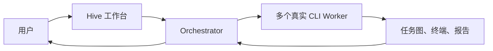

可以先用两句话理解：

```text
Hive：把多个真实 CLI Agent 组织成一个看得见的本地开发团队。
Codex：在统一运行时中创建和管理多个 Thread 子代理。
```

Hive 相对 Codex 主要好在：

1. 真实 CLI 进程和终端更容易观察。
2. `.hive/tasks.md` 让项目任务状态显式持久化。
3. `team send` / `team report` 让通信协议更容易理解。
4. 可以混用 Codex、Claude、Gemini、OpenCode 等 CLI。
5. Auto-staff 和 Workflows 更适合固定团队流程。

## 2. 真实 CLI 团队

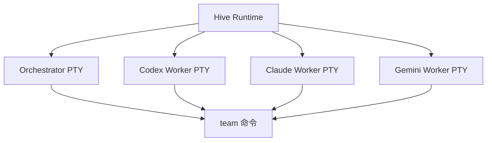

Hive README 将 Orchestrator 和 Worker 描述为真实 CLI 进程，并通过 PTY（伪终端）运行。Hive 本身主要负责启动、连接、展示和协调这些进程，而不是替换它们。

### 2.1 Hive 的运行方式

Hive 会在浏览器工作台中展示：

- Orchestrator 终端
- 每个 Worker 的终端
- Worker 的工作状态
- 任务和报告
- 重新启动或恢复入口

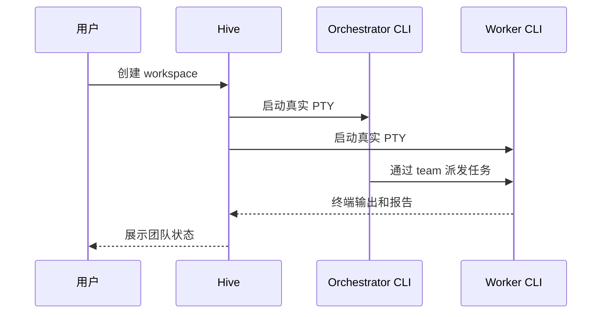

这种方式的关键优势是“过程可见”。用户可以直接看到 Worker 是否执行了命令、是否卡住、是否退出，而不只看到主代理整理后的最终结论。

### 2.2 与 Codex Thread 的区别

Codex 子代理主要以独立 Thread 存在，由 `AgentControl`、Thread Manager、代理注册表和代理间通信管理。

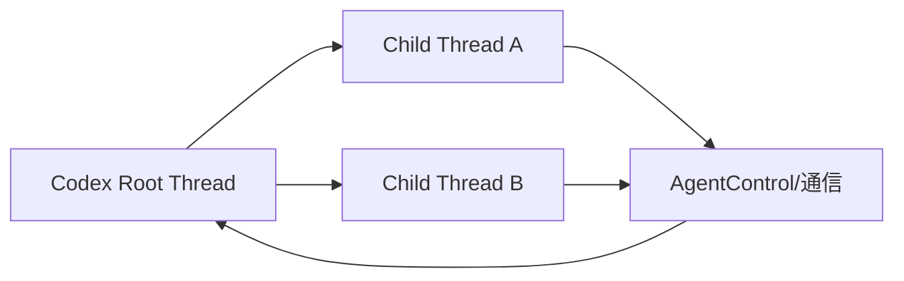

Hive 的 Worker 是外部 CLI 进程；Codex 的子代理是 Codex 运行时内的 Thread。前者更适合观察真实终端和混用工具，后者更适合统一管理模型配置、上下文 fork、权限和生命周期。

## 3. 显式任务图和状态

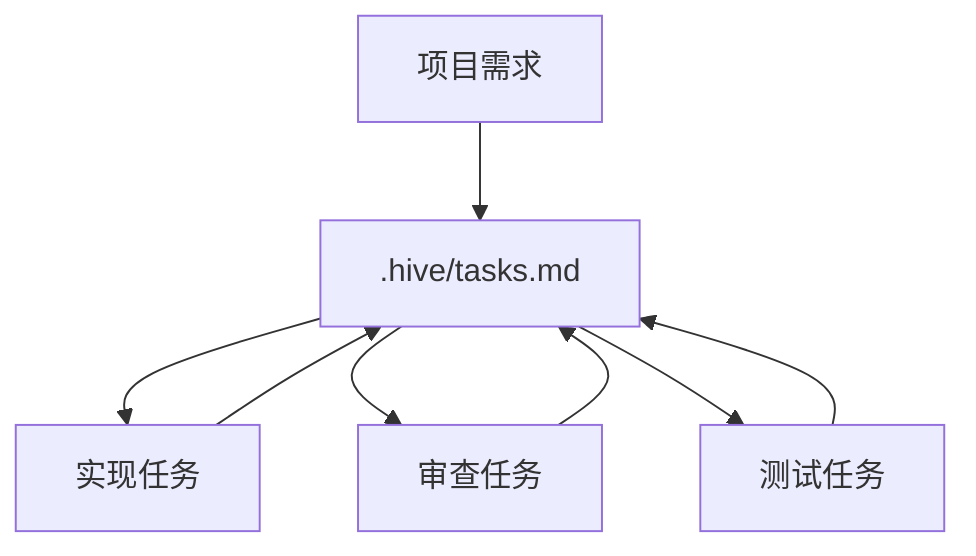

### 3.1 `.hive/tasks.md` 的作用

Hive 会在工作区中维护：

```text
<workspace>/.hive/tasks.md
```

它把任务状态从聊天上下文中拿出来，成为项目目录中的共享 Markdown 文件。人和代理都可以查看任务列表、完成状态和任务依赖。

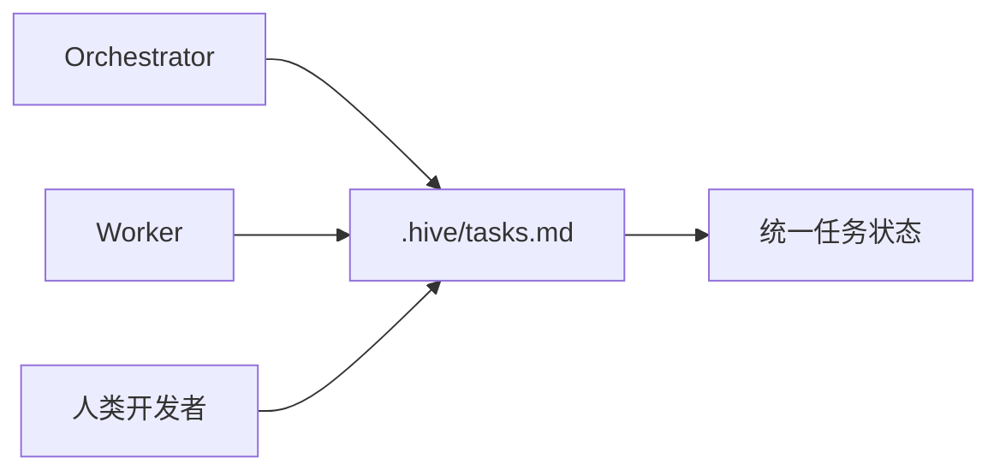

这对长期项目很重要，因为项目约束和任务进度不会只存在某个代理的临时上下文里。重启 Hive、换一个 Worker 或交接任务时，仍然可以从文件恢复整体进度。

### 3.2 与 Codex 会话历史的区别

Codex 也会持久化 Thread、rollout 和父子代理关系，但重点是保存代理会话和执行历史。

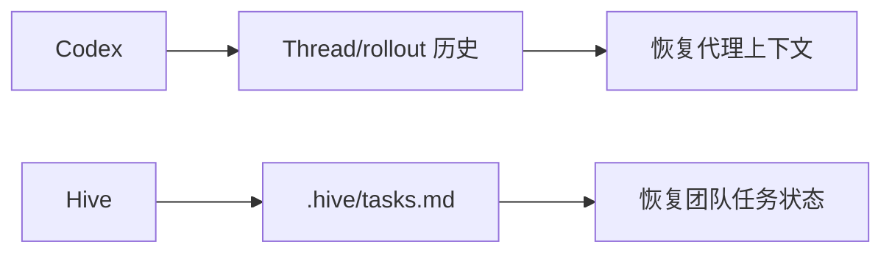

二者的关注点不同：

| 机制 | 更像什么 | 主要回答的问题 |
| --- | --- | --- |
| Codex Thread/rollout | 代理会话记录 | 这个代理之前做了什么？ |
| Hive `.hive/tasks.md` | 团队任务看板 | 项目整体还有什么没做？ |

因此 Hive 在人机共同管理任务、任务交接和项目级进度方面更直观；Codex 在恢复模型上下文和代理运行状态方面更原生。

## 4. 简单明确的团队通信

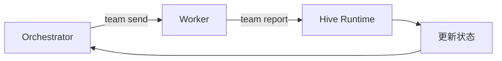

### 4.1 `team send` 和 `team report`

Hive 注入了内部 `team` 命令，典型协作流程是：

```text
Orchestrator：team send worker-a "实现设置搜索"
Worker：执行任务
Worker：team report
Hive：保存报告并更新 Worker 状态
```

对应关系可以简化为：

| Hive 命令 | 作用 | Codex 中的近似能力 |
| --- | --- | --- |
| `team send` | 派发任务 | `send_message` 或 `followup_task` |
| `team report` | 显式报告完成和结果 | 代理间通信 |
| `team list` | 查看团队成员和状态 | `list_agents` |
| `team spawn` | 创建 Worker | `spawn_agent` |

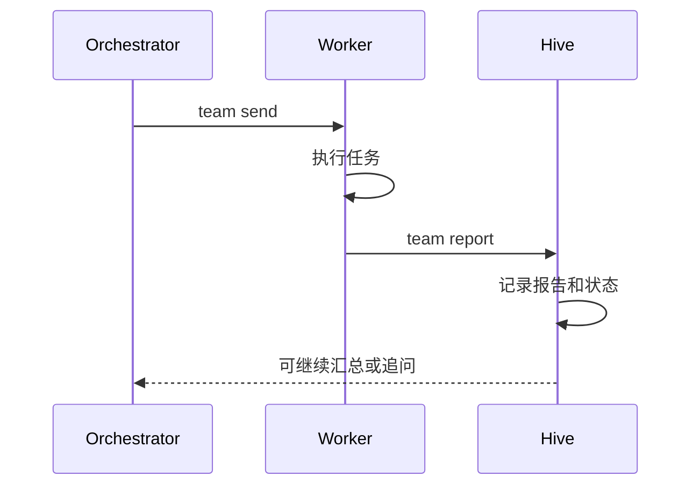

### 4.2 汇报机制的优点和边界

Hive 的优点是把“完成”变成了显式动作。README 说明，Worker 调用 `team report` 后才会回到 `idle`，Hive 不只是根据进程有没有输出来猜测任务是否结束。

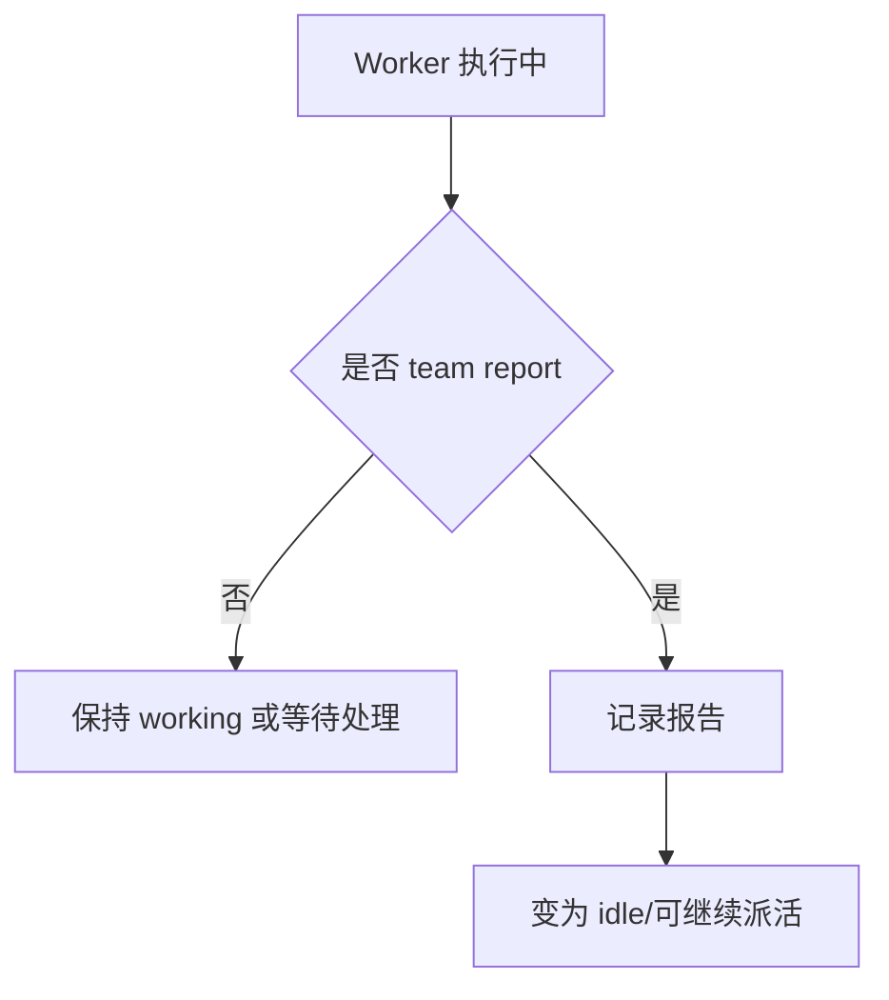

但 `team report` 仍然是协作协议，不是事实证明。Worker 可能报告得不完整，也可能错误地声称任务完成。因此 Orchestrator 仍然需要检查：

- 修改了哪些文件
- 是否运行测试
- 测试是否真的通过
- 报告是否有具体证据
- 是否违反了任务范围

## 5. 多 CLI 和角色协作

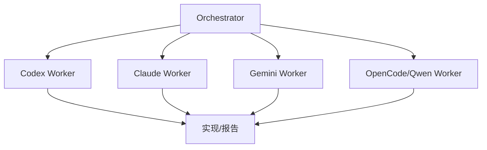

### 5.1 混用不同 Agent

Hive 不绑定单一 Agent 模型。一个团队可以安排：

```text
Orchestrator：Codex
实现 Worker：Claude Code
审查 Worker：Gemini
测试 Worker：OpenCode
```

这样可以让不同 Agent 交叉验证同一个任务。

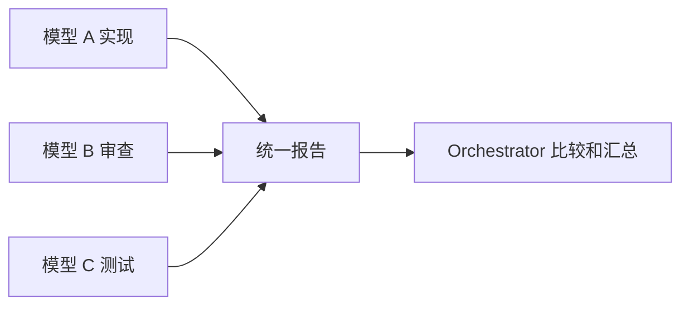

这比单一模型树的优势在于模型多样性，而不是某个单独模型一定更强。不同 Agent 可能拥有不同的上下文能力、工具体验和错误倾向，交叉结果有助于发现遗漏。

### 5.2 角色分工

Hive 的角色更接近真实团队岗位：

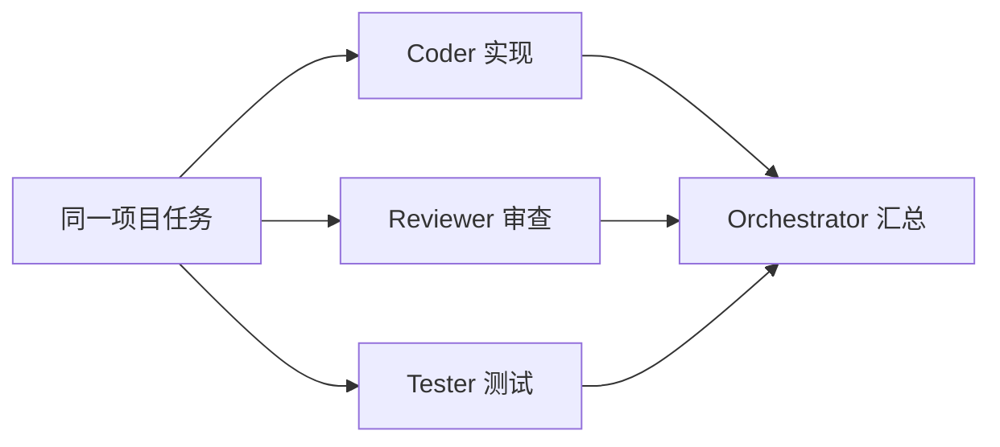

常见分工是：

| 角色 | 关注点 | 产出 |
| --- | --- | --- |
| Coder | 修改代码和实现功能 | 修改文件、实现说明 |
| Reviewer | 查找缺陷和边界问题 | 审查意见、风险清单 |
| Tester | 运行测试和补充场景 | 测试结果、回归风险 |
| Researcher | 收集事实和背景 | 证据、调研报告 |

Codex 也有 `agent_type` 和角色配置，但 Hive 的角色在 UI 团队面板中更直接地体现为“岗位”。两者都需要注意：角色提示词是软约束，不等于权限隔离。

## 6. Auto-staff 和 Workflows

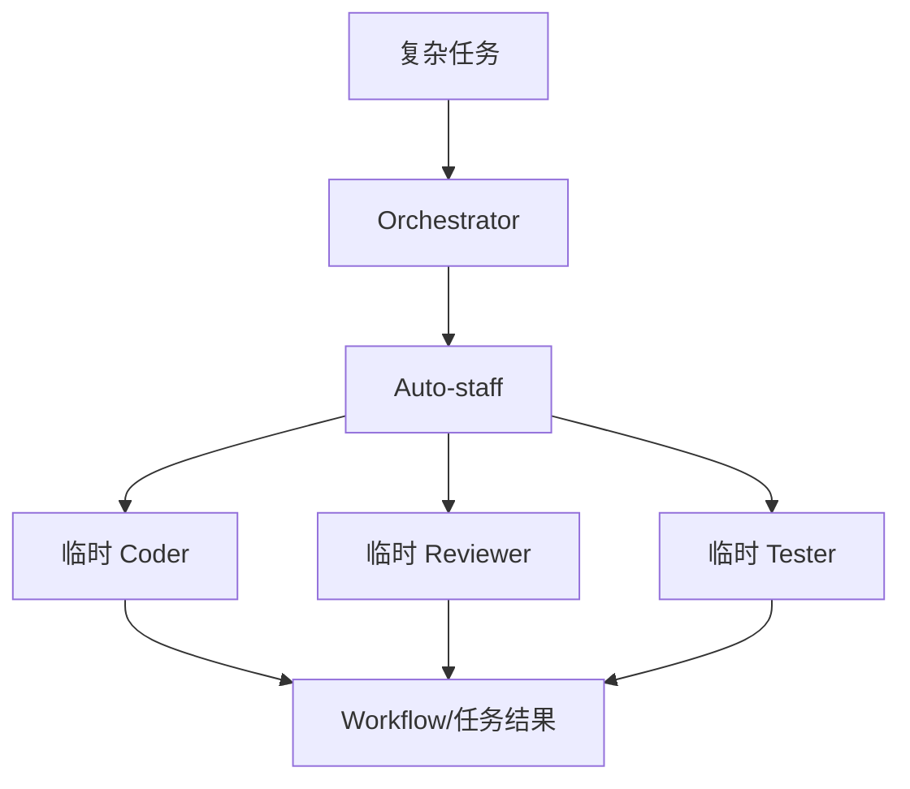

### 6.1 自动组建团队

Hive 的 Auto-staff 允许 Orchestrator 根据任务临时创建一组 Worker，例如：

```text
实现功能 -> 创建 coder
检查风险 -> 创建 reviewer
运行测试 -> 创建 tester
```

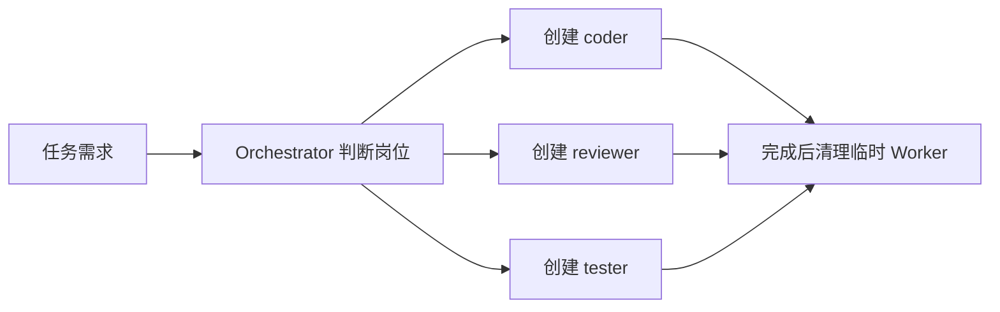

相比手动调用多个 `spawn_agent`，Hive 把“团队人员配置”产品化了。优势是用户不必手动管理每个 Worker，但代价是临时进程、并发和成本可能增加。

### 6.2 多阶段流水线

Hive 的 Workflows 更适合把协作固定成阶段：

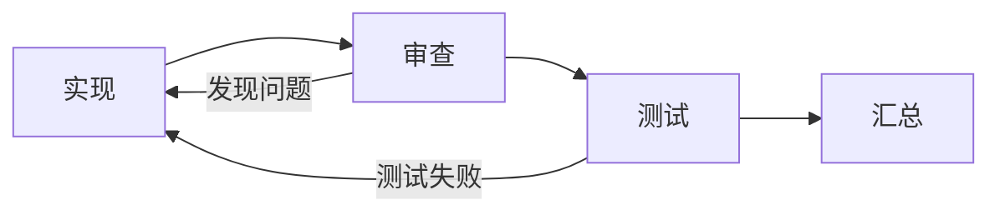

Codex 的主代理也可以动态完成同样的流程，但通常依赖模型在运行中临时决策。Hive Workflows 则更像一个可观察的开发流水线，适合记录每个阶段的日志、结果、停止状态和失败原因。

## 7. Hive 并非全面优于 Codex

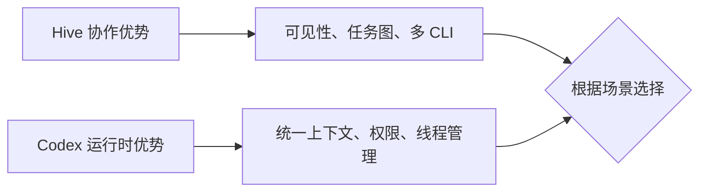

Hive 的主要代价是：

- 需要管理多个真实进程和 PTY。
- 不自带 Agent 沙箱，也不提供完整的多用户权限边界。
- Worker 通常继承运行 Hive 的 shell 权限。
- 不同 CLI 的登录、恢复、参数和平台行为可能不一致。
- Worker 如果不调用 `team report`，任务状态可能不能正确收敛。

Codex 的优势则是统一性更强：模型、Thread、上下文 fork、AgentControl、权限、审批和沙箱都在同一套运行时里管理。

因此 Hive 的优势主要是工作流和可视化，不是安全性或底层代理控制能力。

## 8. 最终选择

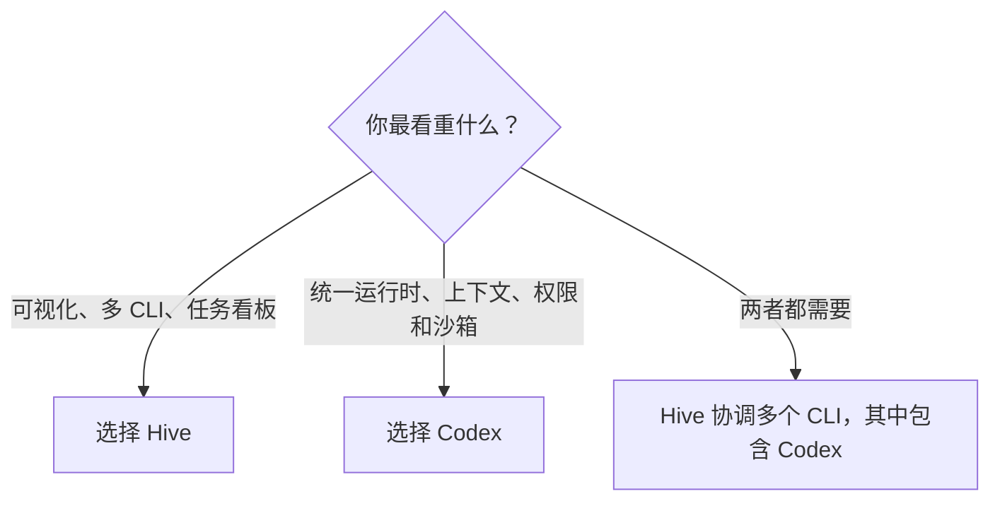

选择 Hive，如果你更看重：

- 看见每个 Agent 的真实终端。
- 在同一项目中混用多个 CLI Agent。
- 用 `.hive/tasks.md` 管理长期任务。
- 通过 `team report` 形成明确的工作交接。
- 使用 Auto-staff 和 Workflows 组织固定流程。

选择 Codex，如果你更看重：

- 统一的 AgentControl 和 Thread 生命周期。
- 原生的上下文继承和历史 fork。
- 更统一的模型、权限、审批和沙箱配置。
- 少管理一层外部 CLI 进程。

最准确的结论是：

> Hive 更像“本地多代理团队协作平台”；Codex 更像“带原生子代理能力的智能编码运行时”。Hive 解决的是多个 Agent 如何像团队一样工作，Codex 解决的是多代理如何在一个受控运行时中执行。
