# Codex 主代理与子代理机制介绍

> 本文基于 Codex 开源仓库中的 Rust 核心实现整理，帮助初学者理解 Codex 的主代理（Main Agent）、子代理（Subagent）、线程（Thread）、配置继承、任务调度、结果汇报和角色机制。

## 目录

- [1. 快速概览](#1-快速概览)
- [2. 核心概念](#2-核心概念)
- [3. 子代理配置如何决定](#3-子代理配置如何决定)
  - [3.1 配置来源](#31-配置来源)
  - [3.2 模型与推理强度](#32-模型与推理强度)
  - [3.3 记忆和上下文继承](#33-记忆和上下文继承)
  - [3.4 运行环境与权限继承](#34-运行环境与权限继承)
- [4. 主代理如何决定子代理和任务](#4-主代理如何决定子代理和任务)
- [4.1 主代理的决策过程](#41-主代理的决策过程)
- [4.2 spawn_agent 的任务参数](#42-spawn_agent-的任务参数)
- [4.3 并发和嵌套限制](#43-并发和嵌套限制)
- [4.4 主代理决策提示词](#44-主代理决策提示词)
- [5. 子代理如何向主代理汇报](#5-子代理如何向主代理汇报)
  - [5.1 代理间通信](#51-代理间通信)
  - [5.2 等待、追问与中断](#52-等待追问与中断)
- [5.3 汇报内容的边界](#53-汇报内容的边界)
- [5.4 子代理汇报提示词](#54-子代理汇报提示词)
- [5.5 不按提示词执行时如何约束](#55-不按提示词执行时如何约束)
- [6. 角色机制](#6-角色机制)
- [6.1 agent_type 的作用](#61-agent_type-的作用)
- [6.2 角色配置的来源](#62-角色配置的来源)
- [6.3 角色提示词、软约束与硬约束](#63-角色提示词软约束与硬约束)
- [6.4 角色不是安全隔离](#64-角色不是安全隔离)
- [6.5 不同角色的区别](#65-不同角色的区别)
- [6.6 软约束与硬约束提示词的区别](#66-软约束与硬约束提示词的区别)
- [7. 一个完整例子](#7-一个完整例子)
- [8. 适用场景与局限](#8-适用场景与局限)
- [9. 源码阅读路线](#9-源码阅读路线)

## 1. 快速概览

Codex 的主子代理机制不是“主代理调用几个普通函数”，而是“主代理创建多个独立的线程会话”。每个子代理有自己的会话状态、模型循环、工具调用和历史记录，但共享同一棵代理树的控制平面。

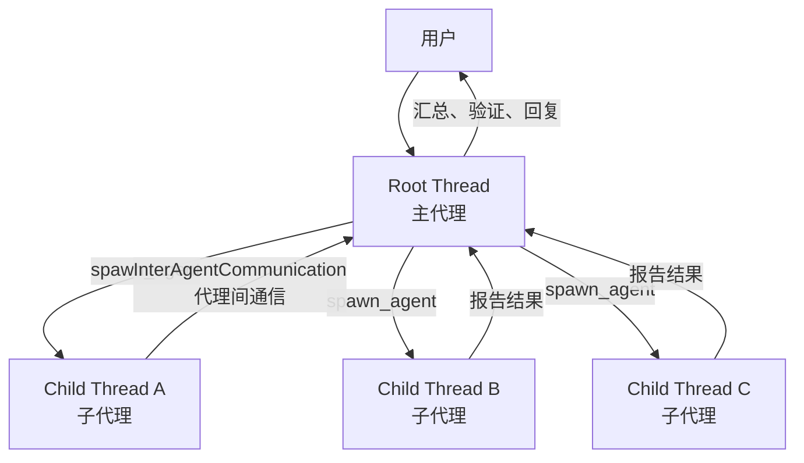

最重要的分工是：

| 参与者 | 主要职责 |
| --- | --- |
| 主代理 | 理解用户目标、拆分任务、创建子代理、选择配置、汇总和验证结果 |
| 子代理 | 执行局部任务、调用工具、分析或修改代码、向主代理报告 |
| Codex 运行时 | 创建线程、保存父子关系、限制并发和深度、传递消息、管理生命周期 |

## 2. 核心概念

### 2.1 主代理

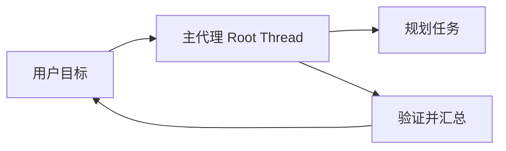

主代理通常就是用户最初进入的根线程（Root Thread）。源码中不一定存在一个名为 `MainAgent` 的结构体，更准确的理解是：

```text
root thread = 主代理所在的会话线程
```

主代理持有 `AgentControl`，这个控制对象负责：

- 创建子代理
- 查找和管理代理
- 发送代理间消息
- 等待或中断代理
- 管理代理树范围内的并发资源

核心定义见：[`AgentControl`](C:/Users/yejunbo/Desktop/codex/codex-rs/core/src/agent/control.rs:75)。

### 2.2 子代理

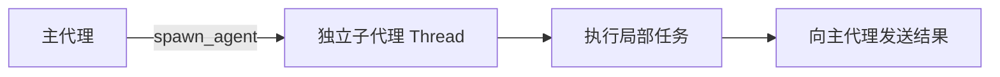

子代理是由主代理调用 `spawn_agent` 创建的独立 Codex Thread。它有自己的：

- `thread_id`（线程标识）
- 会话状态
- 对话历史
- 工具调用过程
- 模型执行循环
- 生命周期状态

但它仍然属于主代理创建的代理树，并共享 `AgentControl` 等控制能力。

### 2.3 AgentPath 和父子关系

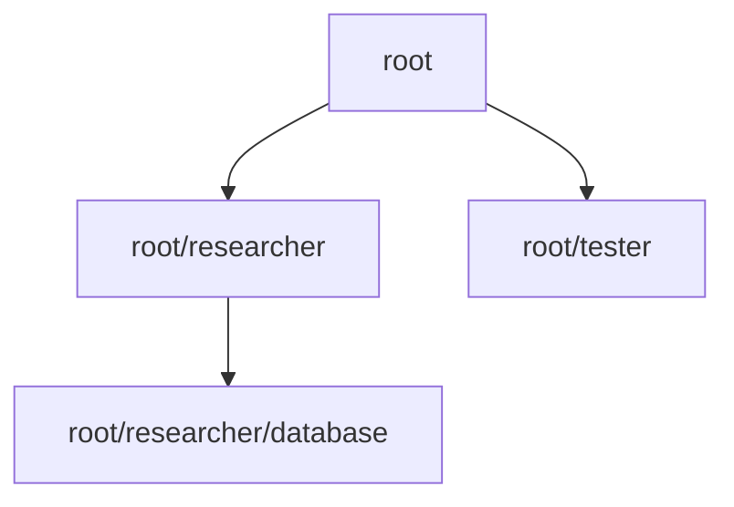

代理使用路径表示层级：

```text
root
├── researcher
├── tester
└── reviewer
    └── documentation
```

每个子代理还会记录：

- `parent_thread_id`：父线程 ID
- `depth`：嵌套深度
- `agent_path`：代理路径
- `agent_role`：角色名称

父子关系会持久化到 thread spawn edge（线程创建边）中，相关类型见：[`agent-graph-store`](C:/Users/yejunbo/Desktop/codex/codex-rs/agent-graph-store/src/types.rs:1)。

## 3. 子代理配置如何决定

子代理配置不是单独从某一个文件读取，而是多层合并的结果：

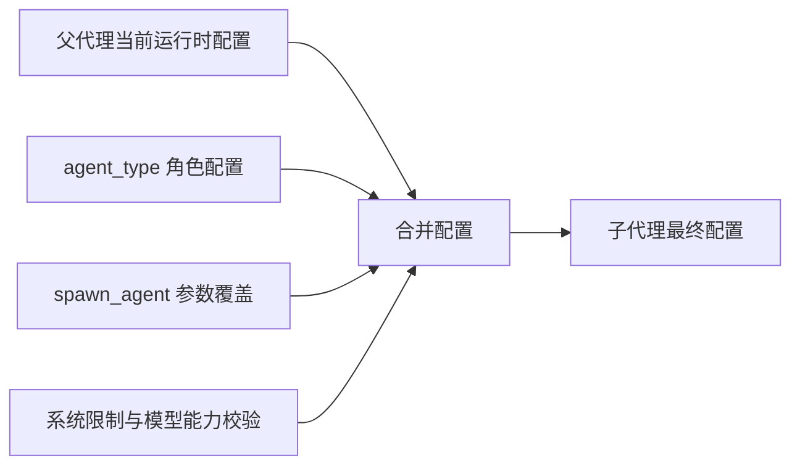

可以概括为：

```text
最终子代理配置
= 父代理当前配置
  + 角色配置
  + spawn_agent 临时参数
  + 系统和模型校验结果
```

### 3.1 配置来源

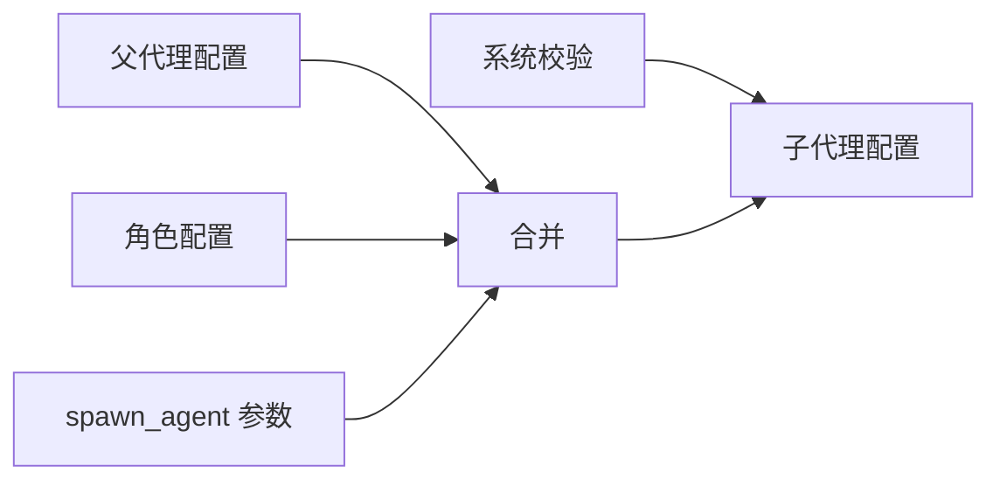

子代理配置主要有四个来源。

#### 来源一：父代理当前配置

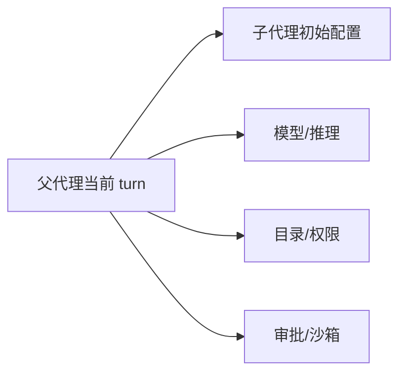

子代理创建时，会先读取父代理当前 turn（本轮执行）的有效配置，而不是简单读取一份过时的静态配置。

它通常继承：

- 当前模型
- 模型提供商
- 推理强度
- developer instructions（开发者指令）
- 当前目录
- 权限策略
- 审批策略
- 沙箱和环境设置

构建配置的函数是 [`build_agent_spawn_config`](C:/Users/yejunbo/Desktop/codex/codex-rs/core/src/tools/handlers/multi_agents_common.rs:137)。

#### 来源二：角色配置

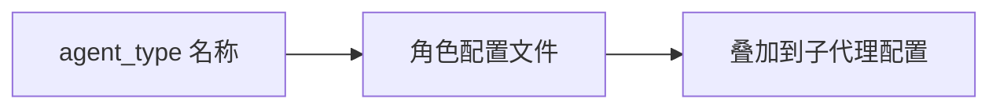

如果主代理传入 `agent_type`，系统会加载对应角色，再把角色配置叠加到基础配置上。

#### 来源三：spawn_agent 参数

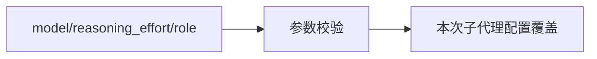

主代理可以为这一次子代理创建请求临时指定：

- 模型
- 推理强度
- 服务等级
- 角色类型
- 任务名称
- 历史继承范围

#### 来源四：运行时约束

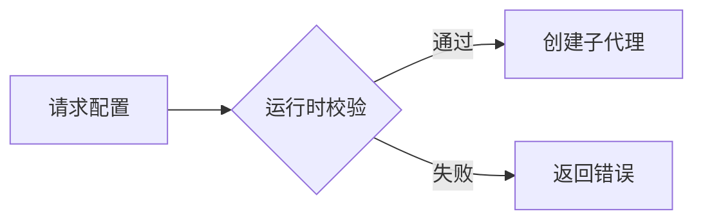

即使主代理提出了请求，系统还会检查：

- 模型是否存在
- 模型是否支持指定推理强度
- 并发数是否超限
- 嵌套深度是否超限
- 权限配置是否有效
- 当前代理管理器是否仍然可用

检查失败时，`spawn_agent` 会返回错误，而不是偷偷使用一个不可预测的备用配置。

### 3.2 模型与推理强度

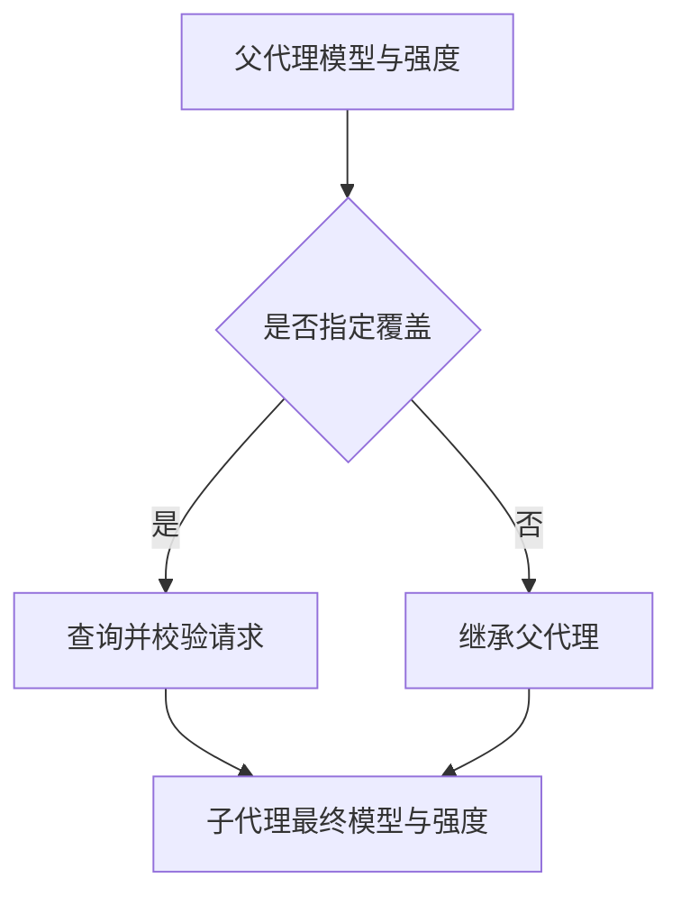

普通创建模式下，主代理可以请求不同模型和推理强度：

```json
{
  "task_name": "security",
  "message": "检查登录模块的安全问题",
  "model": "指定模型",
  "reasoning_effort": "high",
  "fork_turns": "none"
}
```

如果不传 `model` 或 `reasoning_effort`，通常继承父代理当前 turn 的模型和推理配置。

请求模型时，系统会先查询可用模型、确认模型名称，再读取模型元数据。相关代码见 [`apply_requested_spawn_agent_model_overrides`](C:/Users/yejunbo/Desktop/codex/codex-rs/core/src/tools/handlers/multi_agents_common.rs:216)。

完整历史 fork（`fork_turns = "all"`）有一个重要限制：不能同时覆盖 `agent_type`、`model` 和 `reasoning_effort`。因为完整 fork 的目标是保持父代理上下文和执行配置的一致性。

### 3.3 记忆和上下文继承

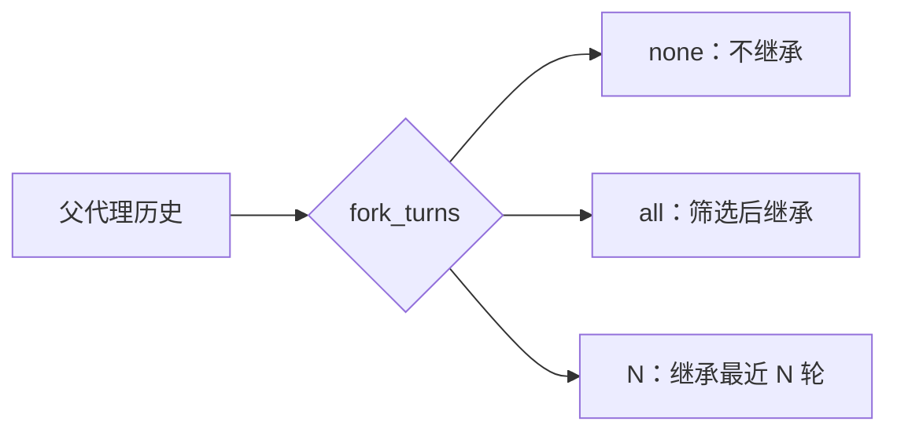

这里要区分“会话历史”和“长期记忆”：

```text
会话历史：当前 thread 里的对话、用户消息、最终回答等
长期记忆：跨会话保存的 memory 数据
```

`spawn_agent` 直接控制的主要是会话历史。

#### 不继承历史：`fork_turns = "none"`

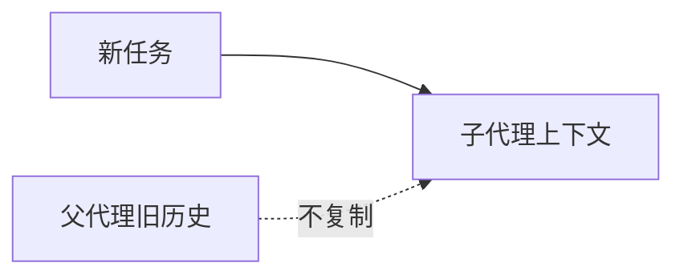

子代理只拿到自己的任务、系统指令和运行环境，不读取父代理此前的完整对话。

适合相互独立的任务：

```text
请独立检查 src/auth 目录中的安全问题，不需要参考主代理之前的分析。
```

#### 继承完整历史：`fork_turns = "all"`

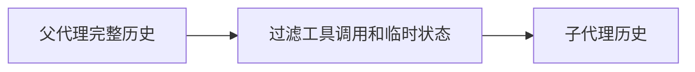

子代理从父代理历史创建 fork，但不是机械复制所有记录。系统会过滤：

- 工具调用
- 工具输出
- 中间推理
- 已完成的代理通信
- 某些临时运行状态

通常保留 system、developer、user 和 assistant 最终回答等内容。过滤规则见 [`keep_forked_rollout_item`](C:/Users/yejunbo/Desktop/codex/codex-rs/core/src/agent/control/spawn.rs:38)。

#### 继承最近 N 轮

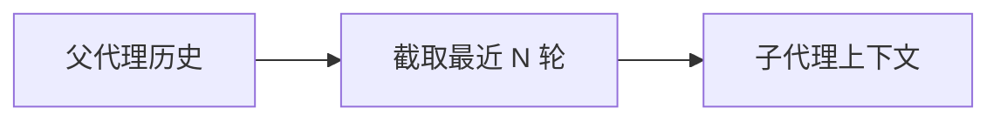

```json
{
  "fork_turns": "2"
}
```

只保留最近若干轮历史，适合子代理只需要最近决策背景的情况。

因此，子代理不是自动拥有主代理全部记忆，而是根据 fork 模式选择性继承会话历史。长期记忆是否可用，还取决于当前功能开关、配置和工具暴露情况。

### 3.4 运行环境与权限继承

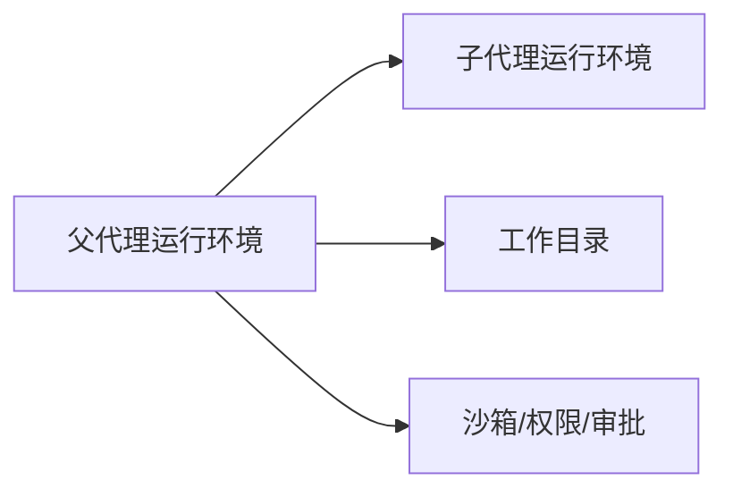

子代理一般会继承父代理当前的：

- 当前工作目录
- 审批策略
- 权限 profile（权限配置档）
- 沙箱设置
- 环境选择
- 执行策略

相关逻辑见 [`apply_spawn_agent_runtime_overrides`](C:/Users/yejunbo/Desktop/codex/codex-rs/core/src/tools/handlers/multi_agents_common.rs:296)。

这意味着子代理可以直接在同一个项目里工作，但也意味着多个子代理同时修改同一个文件时可能互相干扰。

## 4. 主代理如何决定子代理和任务

主代理的任务拆分过程可以概括为：

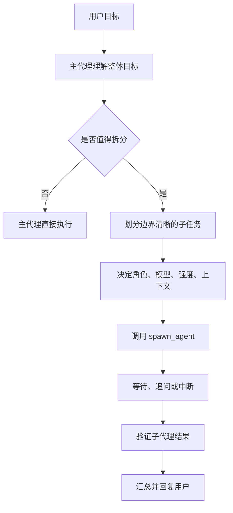

### 4.1 主代理的决策过程

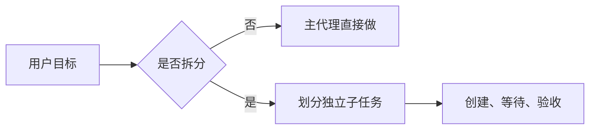

主代理通常需要做六个判断：

1. 任务是否能拆成相互独立的部分。
2. 哪些工作适合交给子代理。
3. 子代理是否需要父代理历史。
4. 子代理需要什么模型和推理强度。
5. 子代理是否应该修改代码，还是只做分析。
6. 什么时候等待、追问、验收或中断。

例如用户要求“检查登录功能并修复问题”，可以拆成：

```text
security：检查安全问题，只分析
tests：检查测试覆盖率
implementation：根据确认后的问题修改代码
```

这种拆法的关键是任务边界清晰，避免多个子代理同时修改同一个核心文件。

### 4.2 spawn_agent 的任务参数

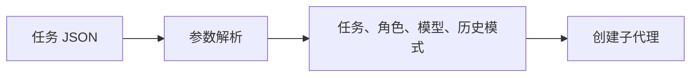

`spawn_agent` 的主要参数包括：

| 参数 | 作用 |
| --- | --- |
| `task_name` | 子代理在父子树中的任务名称 |
| `message` | 子代理收到的初始任务 |
| `agent_type` | 使用的角色类型 |
| `model` | 请求使用的模型 |
| `reasoning_effort` | 请求的推理强度 |
| `service_tier` | 请求的服务等级 |
| `fork_turns` | 继承全部、最近 N 轮或不继承历史 |

工具入口见 [`multi_agents_v2/spawn.rs`](C:/Users/yejunbo/Desktop/codex/codex-rs/core/src/tools/handlers/multi_agents_v2/spawn.rs:35)。

一个好的任务描述应该包含：

```text
任务目标：检查什么
范围：检查哪些目录或文件
限制：是否允许修改代码
产出：报告需要包含什么
验收：是否需要运行测试
```

示例：

```text
检查 src/auth 目录中的认证安全问题。
只分析，不修改代码。
报告必须包含文件位置、问题原因、风险等级、复现依据和修复建议。
最后说明是否运行过测试。
```

### 4.3 并发和嵌套限制

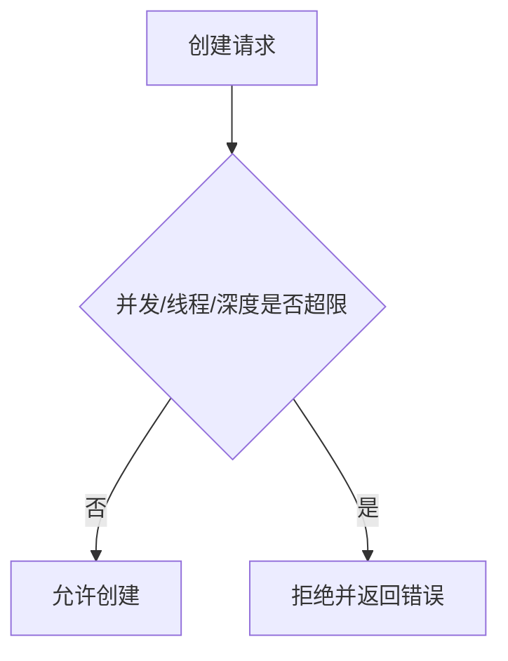

系统支持配置：

```toml
[multi_agent_v2]
enabled = true
max_concurrent_threads_per_session = 4

[agents]
max_threads = 8
max_depth = 3
```

其中：

- `max_concurrent_threads_per_session`：当前代理树的并发线程限制。
- `max_threads`：允许打开的代理线程数量。
- `max_depth`：子代理继续创建子代理时允许的最大深度。

创建过程中会先申请执行容量和 spawn slot（创建槽位）。超限时直接失败。核心流程见 [`spawn_agent_internal`](C:/Users/yejunbo/Desktop/codex/codex-rs/core/src/agent/control/spawn.rs:230)。

### 4.4 主代理决策提示词

```mermaid
flowchart LR
    G[主代理决策提示词] --> D[判断是否拆分]
    D --> T[定义范围和验收标准]
    T --> C[调用 spawn_agent]
```

主代理的决策提示词，目标不是让它“盲目创建更多代理”，而是让它先判断任务是否值得拆分，再决定子任务边界和验收方式。推荐使用下面的提示词模板：

```text
你是主代理，负责最终理解用户目标、规划任务、管理子代理并对最终结果负责。

在创建子代理前：
1. 先判断任务是否可以拆成相互独立、边界清晰的子任务。
2. 如果任务简单，直接完成，不要为了并行而创建子代理。
3. 不要让多个子代理同时修改同一个文件或同一段核心逻辑。
4. 为每个子代理明确写出：目标、范围、是否允许修改、必须产出的证据和验收标准。
5. 只有在子任务相互独立时才并行创建；有依赖关系时按顺序执行。
6. 根据任务复杂度选择模型、推理强度和历史继承范围，不要默认继承全部历史。
7. 子代理返回后，不要只相信结论；检查文件位置、修改内容、测试命令和测试结果。
8. 对互相矛盾的报告进行复核，必要时向子代理追问或重新分配任务。
9. 最终回复用户前，确认所有子任务状态，并明确说明未完成或未验证的部分。
```

这段提示词属于行为指导，不是绝对安全边界。它主要影响主代理如何规划和调用工具；真正的硬限制仍然由 `spawn_agent` 的参数解析、配置校验、并发限制、权限策略和后续验证负责。

主代理创建任务时，推荐使用下面的任务模板：

```text
任务目标：
检查范围：
明确不包含：
是否允许修改代码：只分析 / 可以修改
必须提供的证据：文件路径、行号、复现过程或测试输出
验收标准：
完成后必须报告：结论、证据、影响、建议、修改和验证情况
```

## 5. 子代理如何向主代理汇报

### 5.1 代理间通信

子代理的报告不是普通函数返回值，而是通过 `InterAgentCommunication`（代理间通信）发送给主代理。

```mermaid
sequenceDiagram
    participant R as 主代理 root
    participant M as AgentControl
    participant C as 子代理 root/security
    participant Q as 输入队列/邮箱

    R->>M: spawn_agent(task)
    M->>C: 创建独立 Thread
    M->>C: 发送初始任务消息
    C->>C: 推理、调用工具、分析或修改
    C->>Q: 写入报告消息
    Q-->>R: mailbox activity
    R->>M: wait_agent / list_agents
    R->>C: send_message 或 followup_task
    R->>R: 验证并汇总结果
```

通信结构中通常包含：

- 发送者 `author`
- 接收者 `recipient`
- 消息文本
- 是否触发接收者的新一轮 turn
- 通信上下文
- 通信类型

创建通信消息的函数是 [`communication_from_tool_message`](C:/Users/yejunbo/Desktop/codex/codex-rs/core/src/tools/handlers/multi_agents_v2.rs:58)。

### 5.2 等待、追问与中断

```mermaid
flowchart TD
    R[主代理管理子代理] --> W[wait_agent]
    R --> F[followup_task]
    R --> M[send_message]
    R --> I[interrupt_agent]
```

主代理可以通过几个协作工具管理子代理：

| 工具 | 作用 |
| --- | --- |
| `wait_agent` | 等待代理活动、消息或超时 |
| `list_agents` | 查看代理名称和当前状态 |
| `send_message` | 给已有代理发送信息 |
| `followup_task` | 给已有代理追加任务并触发继续执行 |
| `interrupt_agent` | 停止正在执行的代理 |

`wait_agent` 的本质是等待输入队列状态变化，不代表所有子代理都已经完成。代码见 [`wait.rs`](C:/Users/yejunbo/Desktop/codex/codex-rs/core/src/tools/handlers/multi_agents_v2/wait.rs:40)。

主代理收到“有活动发生”后，还要结合代理状态和消息内容判断：

```text
是某个子代理完成了？
是子代理提出了问题？
是新的输入打断了等待？
还是等待超时？
```

### 5.3 汇报内容的边界

```mermaid
flowchart LR
    C[子代理执行结果] --> M[代理间消息]
    M --> R[主代理收到报告]
    R --> V[证据复核]
```

系统负责传递消息和记录来源，但不会自动保证报告质量。报告详细程度主要取决于：

- 主代理给出的任务说明
- 子代理模型能力
- 子代理继承的上下文
- 是否要求提供证据
- 主代理是否继续追问

推荐子代理使用固定报告格式：

```text
任务：

结论：

证据：
1. 文件和行号
2. 复现过程或测试结果

影响：

建议：

修改情况：修改了哪些文件，还是没有修改

验证情况：运行了哪些测试，结果是什么

遗留问题：
```

主代理不应该仅凭一句“已经完成”就接受结果，而应该要求：

- 具体文件位置
- 具体错误原因
- 修改内容
- 测试命令和输出
- 未解决问题

### 5.4 子代理汇报提示词

```mermaid
flowchart LR
    P[汇报提示词] --> F[固定报告字段]
    F --> E[证据/修改/测试]
    E --> R[主代理可复核报告]
```

子代理的初始任务消息也可以包含专门的汇报提示词。推荐模板如下：

```text
你是子代理，负责完成主代理分配的局部任务，不负责改变整体目标。

执行要求：
1. 只在指定范围内工作；发现范围外问题时列为附加发现，不要擅自扩大任务。
2. 如果任务要求“只分析”，禁止修改文件。
3. 如果任务允许修改，先说明准备修改什么，再实施修改。
4. 不要把猜测写成事实；无法确认时明确标记为“待确认”。
5. 每个重要结论都提供证据，包括文件路径、行号、命令输出或测试结果。
6. 遇到权限、环境、依赖或任务定义问题时，立即报告阻塞原因，不要假装完成。
7. 完成后严格按照以下格式汇报：

任务：
执行范围：
结论：
证据：
影响：
修改情况：
验证情况：
未完成事项或风险：
建议主代理下一步：
```

对于代码修改型子任务，还应追加：

```text
修改前先确认目标文件和影响范围。
修改后列出每个修改文件及其目的。
运行最相关的测试或检查命令；没有运行时必须明确说明原因。
不要以“代码看起来没问题”代替测试证据。
```

子代理的汇报本质上仍然是模型生成的文本。提示词可以提高格式稳定性，但不能保证内容真实，因此主代理必须复核。

### 5.5 不按提示词执行时如何约束

```mermaid
flowchart LR
    P[提示词偏离] --> Q[主代理追问]
    Q --> F[followup_task]
    F --> V[重新验收]
    V -->|仍不合格| I[interrupt_agent]
```

约束强度可以分为四层：

```mermaid
flowchart TD
    P[行为提示词\n告诉代理应该怎么做] --> T[工具参数约束\n限制字段、类型和取值]
    T --> R[运行时硬约束\n权限、模型、并发、深度、状态]
    R --> V[主代理验收\n检查证据、测试和修改]
    V -->|不合格| F[追问、补任务或中断]
    V -->|合格| O[纳入最终结果]
```

#### 第一层：提示词约束

```mermaid
flowchart LR
    P[角色和任务提示词] --> B[模型行为倾向]
    B --> E[建议、格式和范围]
```

提示词可以要求：

- 只分析不修改
- 只处理指定目录
- 必须提供证据
- 必须运行测试
- 使用固定报告格式

但提示词本身属于软约束，模型仍可能偏离。

#### 第二层：工具和参数约束

```mermaid
flowchart LR
    J[工具调用参数] --> V[Schema/类型校验]
    V -->|合法| E[进入运行时]
    V -->|非法| X[调用失败]
```

`spawn_agent` 使用结构化参数解析，并拒绝未知字段。`fork_turns` 只能是 `none`、`all` 或正整数等合法值；模型、推理强度和角色也需要经过代码校验。

这类约束可以防止参数格式错误，但不能单独阻止子代理在工具允许的范围内做出错误判断。

#### 第三层：运行时硬约束

```mermaid
flowchart LR
    C[执行请求] --> P[权限/审批/沙箱]
    P --> R[并发/深度/状态]
    R --> E[实际执行或拒绝]
```

运行时可以真正限制：

- 是否能创建子代理
- 最大并发数
- 最大嵌套深度
- 当前模型是否可用
- 权限和审批策略
- 沙箱和工作环境
- 子代理是否仍然存活

如果子代理试图创建超出限制的后代代理，或者请求不可用模型，调用会失败。

#### 第四层：主代理验收和纠偏

```mermaid
flowchart LR
    R[子代理报告] --> V{主代理验收}
    V -->|通过| O[汇总]
    V -->|不通过| F[追问或重派]
```

如果子代理没有按要求报告，主代理可以：

```text
send_message：要求补充缺失字段或证据
followup_task：要求重新执行或完成验证
interrupt_agent：停止不必要或失控的任务
list_agents：检查当前代理状态
```

但是，主代理追问仍然属于模型协作过程，不是文件系统级的绝对隔离。若任务需要强安全边界，应同时使用更严格的权限、审批和沙箱配置。

## 6. 角色机制

### 6.1 agent_type 的作用

```mermaid
flowchart LR
    T[agent_type] --> P[角色提示词]
    P --> B[行为关注点]
    B --> E[局部任务执行]
```

`agent_type` 是子代理的角色名称，例如：

```json
{
  "agent_type": "researcher"
}
```

角色主要用于给子代理提供专门化的行为配置，例如：

- 研究角色：收集资料、分析代码，不主动修改
- 测试角色：关注测试用例、边界条件和回归风险
- 审查角色：关注代码质量和潜在缺陷
- 实现角色：根据明确要求修改代码并运行测试

角色会被应用到子代理配置中，调用位置是 [`apply_role_to_config`](C:/Users/yejunbo/Desktop/codex/codex-rs/core/src/tools/handlers/multi_agents_v2/spawn.rs:83)。

### 6.2 角色配置的来源

```mermaid
flowchart LR
    N[角色名称] --> C[角色配置]
    C --> M[与父配置合并]
    M --> A[应用本次参数]
```

角色可以在配置文件中声明：

```toml
[agents.researcher]
description = "Research-focused role."
config_file = "./agents/researcher.toml"
nickname_candidates = ["Researcher"]
```

配置结构位于 [`AgentsToml`](C:/Users/yejunbo/Desktop/codex/codex-rs/config/src/config_toml.rs:685)。

角色的配置合并关系可以表示为：

```mermaid
flowchart TD
    B[父代理基础配置] --> M[配置合并]
    T[agent_type = researcher] --> R[读取 researcher 角色]
    R --> M
    P[本次 spawn_agent 参数] --> M
    M --> C[子代理最终配置]
    C --> E[执行局部任务]
```

角色可以改变行为指导和部分配置，但它不是一个全新的程序，也不是一个新的权限账户。

### 6.3 角色提示词、软约束与硬约束

角色最容易被误解的地方是：`researcher`、`reviewer`、`implementer` 看起来像不同类型的代理，但在运行时它们仍然是同一种 Codex agent。角色主要通过配置和提示词改变“应该如何工作”，而不是改变代理的底层能力。

角色提示词可以这样理解：

```text
角色身份：你是代码安全研究员。
关注重点：认证、授权、输入校验、敏感信息和攻击路径。
默认行为：先分析，除非任务明确允许，否则不修改代码。
证据要求：必须给出文件、行号、原因和复现依据。
汇报要求：按结论、证据、风险、建议、验证情况的格式报告。
```

角色提示词通常回答五个问题：

| 问题 | 示例 |
| --- | --- |
| 你是谁 | 安全研究员、测试工程师、代码实现者 |
| 关注什么 | 安全风险、测试覆盖率、性能或代码结构 |
| 默认怎么做 | 只分析、先设计后修改、修改后必须测试 |
| 什么算完成 | 找到证据、补充测试、完成编译或通过指定检查 |
| 如何汇报 | 固定字段、文件位置、测试输出和遗留风险 |

角色提示词与主代理传入的 `message` 不是一回事：

```text
角色提示词 = 长期行为方向
任务 message = 本次具体工作
运行时配置 = 模型、权限、目录、沙箱等执行条件
```

例如：

```text
角色提示词：你是只做分析的安全研究员。
任务 message：检查 src/auth，只分析 JWT 过期和权限绕过问题。
运行时配置：当前项目目录、只读权限、指定模型和推理强度。
```

三者叠加后，才构成一次子代理任务。

#### 什么是软约束

```mermaid
flowchart LR
    P[提示词规则] --> T[模型行为倾向]
    T --> O[可能遵守，也可能偏离]
```

软约束是通过提示词、角色描述和任务说明影响模型行为的规则，例如：

- “只分析，不修改代码。”
- “只检查 `src/auth`。”
- “报告必须包含文件路径和行号。”
- “先运行测试，再给出结论。”
- “不要把未经确认的推测写成事实。”

软约束的特点是：模型可能遵循，也可能误解、遗漏或偏离。它不能单独提供安全保证，也不能阻止模型调用已经暴露给它的工具。

#### 什么是硬约束

```mermaid
flowchart LR
    R[运行时规则] --> V[系统校验]
    V -->|通过| E[允许执行]
    V -->|失败| X[拒绝执行]
```

硬约束由 Codex 运行时、工具协议和权限系统执行，不依赖模型是否“愿意遵守”：

| 硬约束 | 作用 |
| --- | --- |
| 结构化工具参数 | 拒绝未知字段、错误类型和非法取值 |
| 模型校验 | 请求不存在或不支持的模型时失败 |
| 推理强度校验 | 防止使用模型不支持的 reasoning effort |
| 并发限制 | 超过 `max_concurrent_threads_per_session` 时拒绝或限制创建 |
| 线程数量限制 | 受 `agents.max_threads` 控制 |
| 嵌套深度限制 | 受 `agents.max_depth` 控制 |
| 权限和审批策略 | 控制文件、命令和外部操作的实际权限 |
| 沙箱 | 限制运行环境中的可访问资源 |
| 生命周期控制 | 可以查询、追问或中断子代理 |

因此，“只分析不修改”如果只写在角色提示词里，属于软约束；如果同时配置只读权限或严格审批策略，才有更强的硬约束保障。

#### 软硬约束的关系

```mermaid
flowchart TD
    S[软约束：应该怎么做] --> B[模型行为]
    H[硬约束：实际上能不能做] --> X[系统执行边界]
    B --> V[主代理验收]
    X --> V
```

```mermaid
flowchart TD
    R[角色提示词\n长期行为方向] --> B[模型行为倾向]
    M[本次任务 message\n具体目标与产出] --> B
    B --> C{是否调用工具}
    C -->|调用| H[工具协议与参数校验]
    H --> P[权限、审批、沙箱校验]
    P --> X[实际执行]
    C -->|不调用| O[生成分析或报告]
    X --> O
    O --> V[主代理复核证据和结果]
```

关键原则是：

```text
软约束决定“倾向怎么做”。
硬约束决定“实际上能不能做”。
主代理复核决定“结果能不能被接受”。
```

#### 如果角色偏离了任务怎么办

```mermaid
flowchart LR
    D[角色偏离] --> M[send_message 追问]
    M --> F[followup_task 重做]
    F --> V[复核]
    V -->|仍失控| I[interrupt_agent]
```

例如角色是 `researcher`，但它修改了代码，或者报告没有证据，主代理可以按下面顺序处理：

1. 使用 `send_message` 要求补充证据或解释偏离原因。
2. 使用 `followup_task` 要求重新执行，并明确禁止修改或要求运行测试。
3. 检查 `list_agents` 的状态，确认任务是否仍在运行。
4. 如果任务不可接受，使用 `interrupt_agent` 停止它。
5. 对已经产生的文件修改进行人工或主代理复核，不因为角色名称而自动信任。

如果必须从机制上禁止修改，不能只依赖 `researcher` 这个角色名或角色提示词，而应配置只读权限、审批策略或沙箱边界。

### 6.4 角色不是安全隔离

```mermaid
flowchart LR
    R[角色提示词] -.不能单独隔离.-> P[权限/审批/沙箱]
    P --> E[真正的执行边界]
```

需要特别注意：

```text
角色描述 != 能力隔离
角色描述 != 专家能力保证
角色描述 != 权限隔离
```

如果子代理继承父代理的工作目录和权限，它仍然可能读写同一项目。想降低风险，需要同时控制：

- 权限 profile
- 审批策略
- 沙箱
- 是否允许修改代码
- 任务范围
- 是否要求先分析后修改

### 6.5 不同角色的区别

Codex 的角色通常不是写死的固定枚举，而是通过 `agents` 配置和角色文件定义。下面的角色是常见设计示例，不代表所有版本都内置这些角色。

```mermaid
flowchart TD
    T[同一个 Codex 子代理能力] --> R[researcher 研究分析]
    T --> Q[tester 测试验证]
    T --> V[reviewer 代码审查]
    T --> I[implementer 代码实现]
    T --> C[coordinator 任务协调]
```

| 角色 | 主要目标 | 默认行为 | 典型产出 | 默认是否改代码 |
| --- | --- | --- | --- | --- |
| `researcher` | 收集事实、理解代码、定位问题 | 只读分析、提供证据 | 分析报告、候选方案 | 否 |
| `tester` | 发现测试缺口和回归风险 | 运行测试、设计边界用例 | 测试结果和覆盖建议 | 通常否 |
| `reviewer` | 发现缺陷和设计风险 | 按严重程度审查 | 问题清单和修复建议 | 否 |
| `implementer` | 按确认方案落地修改 | 修改、格式化、测试 | 修改文件和测试结果 | 是，但必须限定范围 |
| `coordinator` | 拆分任务、跟踪状态、汇总结果 | 管理代理，不直接改代码 | 计划、状态和阻塞项 | 否 |

```mermaid
flowchart LR
    R[researcher] --> A[分析和证据]
    T[tester] --> B[测试和覆盖率]
    V[reviewer] --> C[缺陷和风险]
    I[implementer] --> D[修改和验证]
    O[coordinator] --> E[任务状态和汇总]
```

角色之间的区别主要是行为目标和产出格式，不是底层模型或权限账户的区别。角色名称本身不能阻止一个 `researcher` 调用写入工具，也不能保证一个 `reviewer` 一定发现所有问题。

### 6.6 软约束与硬约束提示词的区别

严格来说，硬约束不是“更强的提示词”，而是由工具协议、运行时、权限、审批和沙箱执行的规则。

```mermaid
flowchart TD
    P[软约束提示词] --> M[影响模型行为倾向]
    H[硬约束配置和代码] --> E[限制实际执行边界]
    M --> V[主代理验收]
    E --> V
    V --> O[接受、追问、重派或中断]
```

| 对比项 | 软约束提示词 | 硬约束 |
| --- | --- | --- |
| 所在位置 | 角色提示词、任务 message、开发者指令 | 工具 schema、Rust 运行时、权限、审批、沙箱 |
| 约束对象 | 模型的行为倾向、工作方法、报告格式 | 工具调用、权限、资源、线程和执行范围 |
| 是否可能偏离 | 可能误解或不遵守 | 经过系统检查时会被拒绝 |
| 示例 | “只分析，不修改代码” | 只读权限、写入审批、沙箱限制 |
| 失败处理 | 主代理追问或重新派任务 | 工具调用失败、拒绝执行或中断 |

#### 软约束提示词

```mermaid
flowchart LR
    P[角色和任务提示词] --> S[身份与关注点]
    P --> F[输出格式]
    P --> R[工作范围建议]
    S --> M[模型行为倾向]
    F --> M
    R --> M
```

示例：

```text
你是 reviewer，只关注当前改动中的缺陷和风险。
不要修改代码。
每个问题必须包含文件、行号、影响和修复建议。
如果没有证据，只能标记为待确认。
```

软约束负责表达“应该怎么做”，适合描述角色和方法，但不能单独保证模型没有修改文件，也不能保证报告结论真实。

#### 硬约束

```mermaid
flowchart LR
    R[执行请求] --> A[参数和 schema 校验]
    A --> P[权限、审批、沙箱]
    P --> L[并发、深度、生命周期]
    L --> E[允许执行或拒绝]
```

硬约束负责表达“实际上能不能做”，例如：

- 只读权限限制文件写入。
- 审批策略要求危险操作先获得批准。
- 沙箱限制代理可访问的资源。
- 工具 schema 拒绝非法参数。
- `max_threads`、`max_depth` 和并发配置限制代理树规模。
- `interrupt_agent` 可以停止运行中的代理。

如果要真正禁止 `researcher` 修改文件，不能只写“不要修改”这一句提示词，还需要只读权限、审批策略或沙箱边界。

#### 两者如何配合

```mermaid
flowchart TD
    S[软约束：引导模型] --> E[代理尝试执行]
    H[硬约束：限制执行] --> E
    E --> R[子代理报告]
    R --> V[主代理复核证据和测试]
    V -->|不合格| F[追问、重派或中断]
    V -->|合格| O[纳入最终结果]
```

一句话区分：

```text
软约束负责引导行为；硬约束负责限制能力；主代理负责验收结果。
```

## 7. 一个完整例子

用户提出：

```text
检查登录功能并修复明显问题。
```

主代理可以这样安排：

```mermaid
flowchart TD
    U[用户：检查并修复登录功能] --> R[主代理 root]
    R --> S[security 子代理\n只分析安全问题]
    R --> T[tests 子代理\n分析测试覆盖率]
    R --> I[implementation 子代理\n根据确认问题修改代码]
    S --> RS[安全报告]
    T --> RT[测试报告]
    RS --> R
    RT --> R
    R -->|确认问题和修复方案| I
    I --> RI[修改结果与测试结果]
    RI --> R
    R --> V[主代理复核]
    V --> O[回复用户]
```

### security 子代理

```mermaid
flowchart LR
    S[安全任务] --> A[只读分析]
    A --> R[风险报告]
    R --> P[主代理复核]
```

```json
{
  "task_name": "security",
  "message": "检查 src/auth 中的认证、密码校验和权限绕过问题，只分析不修改代码；报告必须包含文件位置、证据、风险和建议",
  "agent_type": "researcher",
  "reasoning_effort": "high",
  "fork_turns": "none"
}
```

### tests 子代理

```mermaid
flowchart LR
    T[测试覆盖率任务] --> A[查找缺失测试]
    A --> R[测试报告]
    R --> P[主代理决策]
```

```json
{
  "task_name": "tests",
  "message": "检查登录相关测试覆盖率，列出缺失的正常、异常和边界测试，不修改代码",
  "fork_turns": "none"
}
```

### implementation 子代理

```mermaid
flowchart LR
    C[已确认问题] --> I[实现代理修改]
    I --> T[运行测试]
    T --> R[修改和验证报告]
```

实现代理最好在主代理确认问题后再创建，避免它基于未经验证的分析直接修改代码：

```json
{
  "task_name": "implementation",
  "message": "根据已确认的问题修复登录模块，修改后运行相关测试，并报告修改文件、测试命令和结果",
  "agent_type": "implementer",
  "fork_turns": "2"
}
```

## 8. 适用场景与局限

### 适合的任务

```mermaid
flowchart LR
    A[任务可独立拆分] --> P[并行分析]
    P --> R[主代理汇总]
```

- 多个相互独立的代码分析
- 安全检查、测试检查、文档检查并行进行
- 对不同目录进行互不冲突的审查
- 先收集信息，再由主代理统一决策

### 不适合的任务

```mermaid
flowchart LR
    C[共享同一文件或强顺序依赖] --> X[并发冲突风险]
    X --> D[不建议拆成多个子代理]
```

- 多个代理同时修改同一个文件
- 强依赖执行顺序的数据库迁移
- 需要共享大量实时状态的任务
- 非常简单、主代理可以直接完成的任务
- 结果必须立即保持强一致的事务型操作

主要局限是：上下文继承可能丢信息或增加 token 成本；多个代理可能产生文件冲突；主代理还必须负责验证和汇总；并发、深度和生命周期管理会增加运行时复杂度。

## 9. 源码阅读路线

```mermaid
flowchart TD
    A[协作工具入口] --> B[spawn_agent 参数处理]
    B --> C[配置与上下文辅助函数]
    C --> D[AgentControl]
    D --> E[线程创建与历史 fork]
    E --> F[消息、状态和父子关系持久化]
```

推荐按下面顺序阅读：

1. [`multi_agents_v2.rs`](C:/Users/yejunbo/Desktop/codex/codex-rs/core/src/tools/handlers/multi_agents_v2.rs:1)：了解协作工具总入口。
2. [`multi_agents_v2/spawn.rs`](C:/Users/yejunbo/Desktop/codex/codex-rs/core/src/tools/handlers/multi_agents_v2/spawn.rs:1)：了解 `spawn_agent` 如何解析参数和创建请求。
3. [`multi_agents_common.rs`](C:/Users/yejunbo/Desktop/codex/codex-rs/core/src/tools/handlers/multi_agents_common.rs:1)：了解配置、路径、模型和上下文辅助逻辑。
4. [`agent/control.rs`](C:/Users/yejunbo/Desktop/codex/codex-rs/core/src/agent/control.rs:75)：了解 `AgentControl` 和共享控制平面。
5. [`agent/control/spawn.rs`](C:/Users/yejunbo/Desktop/codex/codex-rs/core/src/agent/control/spawn.rs:230)：了解真正的线程创建、历史 fork、容量控制和通信发送。
6. `send_message`、`followup_task`、`wait_agent`：了解子代理的后续管理。
7. [`0021_thread_spawn_edges.sql`](C:/Users/yejunbo/Desktop/codex/codex-rs/state/migrations/0021_thread_spawn_edges.sql)：了解父子关系如何持久化。

最终可以用一句话记住这套架构：

> 主代理负责规划、派发、验证和汇总；子代理负责独立执行局部任务；系统负责把子代理变成独立 Thread，并通过 AgentControl、父子路径和 InterAgentCommunication 管理它们之间的关系。
